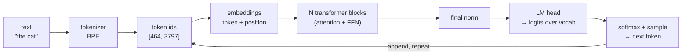
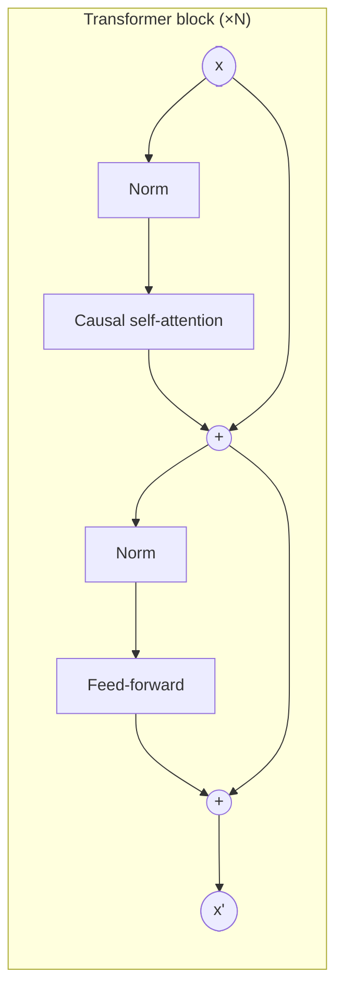
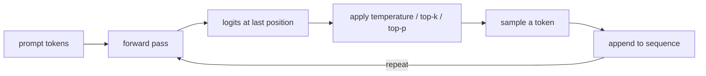

# LLM Fundamentals — an end-to-end explainer

> How a decoder-only language model turns a string of text into the next token,
> one component at a time. This is the **narrative** companion to
> [`modules/m1_fundamentals/README.md`](../modules/m1_fundamentals/README.md)
> (which is reference material + interview Q&A). Here we follow the *data* from
> raw text to a sampled token and explain every box it passes through, grounded
> in this repo's own `src/` code.

**Everything an LLM does reduces to one task: given a sequence of tokens, predict
the next one.** Training tunes the weights so the predicted distribution matches
real text; generation samples from that distribution and feeds the result back
in. Chat, code, translation, reasoning — all emerge from doing next-token
prediction well, at scale. Keep this in mind; the entire architecture exists to
compute one conditional distribution `P(next token | all previous tokens)`.

---

## The 30-second picture



In this repo the whole stack is `SmallGPT` in
[`src/models/gpt.py`](../src/models/gpt.py), built from a `GPTConfig`
([`src/models/config.py`](../src/models/config.py)) via `create_model(...)`. Every
knob below (`pos_encoding`, `norm`, `activation`, …) is a config field, so you can
build a 2019-era GPT-2 or a 2024-era LLaMA-style model from the same code.

---

## 1. Tokenization — text ↔ integers

A neural network consumes numbers, not characters. The **tokenizer** maps text to
a sequence of integer ids and back. The choice trades off two quantities:

- **Vocabulary size** — how many distinct tokens exist (the size of the embedding
  table and output softmax).
- **Sequence length** — how many tokens a given text becomes (attention cost is
  **O(n²)** in this length).

| Scheme | Vocab | Sequence length | Problem |
|---|---|---|---|
| Character | tiny (~100) | very long | attention gets expensive |
| Word | huge, brittle | short | out-of-vocabulary words |
| **Sub-word (BPE)** | **medium (~32k–256k)** | **medium** | **the sweet spot** |

### Byte-Pair Encoding (BPE)

Modern LLMs use **byte-level BPE** ([`bpe_tokenizer.py`](../modules/m1_fundamentals/bpe_tokenizer.py)):

1. Start from the **256 raw byte values** as the base vocabulary. Because any
   text is a sequence of bytes, *every* string is representable — there is no
   out-of-vocabulary token, ever. Emoji, Chinese, control characters all just
   become byte sequences.
2. **Pre-tokenize** with a regex (GPT-2's pattern) so merges never cross word or
   punctuation boundaries. This is why `"dog"` and `" dog"` (with a leading
   space) are *different* tokens.
3. **Iteratively merge** the most frequent adjacent pair of tokens into a new
   token, recording the rule. Repeat until you hit the target vocab size.
   Frequent words collapse into single tokens; rare words fall back to sub-word
   pieces.

**Round-trip guarantee:** `decode(encode(s)) == s` for any UTF-8 string —
lossless, because the byte base plus reversible merges throw nothing away.

**Why this matters in practice (and interviews):**
- *"Why can't the model spell strawberry / count the r's?"* It never sees
  characters — it sees tokens like `straw` + `berry`. Per-character reasoning is
  hidden inside the token.
- *Number tokenization is inconsistent* — `1234` might be one token, `1235` three
  — a real source of arithmetic errors.
- *Multilingual "token tax"* — non-Latin scripts fragment into more bytes/tokens,
  making them cost more and run slower.

---

## 2. Embeddings — ids to vectors (and injecting order)

Each token id indexes a **token embedding** table (`nn.Embedding`, shape
`vocab_size × d_model`), turning `[464, 3797]` into two `d_model`-dimensional
vectors. But attention (next section) is **permutation-equivariant**: with only
token embeddings, `"dog bites man"` and `"man bites dog"` look identical. We must
inject **position**. This repo supports three schemes
([`src/models/embeddings.py`](../src/models/embeddings.py) + [`src/models/rope.py`](../src/models/rope.py)):

| Scheme | How | Extrapolates past training length? |
|---|---|---|
| **Learned** (GPT-2) | a trainable vector per position, added to token emb | ❌ no embedding exists for unseen positions |
| **Sinusoidal** (orig. Transformer) | fixed sin/cos table, added to token emb | partially (defined everywhere) |
| **RoPE** (LLaMA/Qwen/Mistral) | rotate Q,K by an angle ∝ position, inside attention | ✅ best |

### Why RoPE won — the one identity to remember

Instead of *adding* a position vector, **RoPE rotates** each query and key vector
by an angle proportional to its absolute position (per 2-D sub-space of the head
dimension). The payoff:

```
⟨RoPE(q, m), RoPE(k, n)⟩  =  f(q, k, m − n)
```

the attention score between position `m` and position `n` depends **only on the
relative offset `m − n`**, never on absolute positions. So a head that learns
"attend 4 tokens back" keeps working at positions it never saw in training. RoPE
adds **zero parameters**, is applied at attention time, and underlies
context-extension tricks (linear "position interpolation", NTK-aware scaling).

*This repo's experiment* ([`positional_encodings.py`](../modules/m1_fundamentals/positional_encodings.py))
trains tiny models on a delayed-copy task at length 128 and evaluates at 256:
RoPE **matches** learned PE in-distribution (loss 0.005) but crushes it on
extrapolation (**2.19 vs 5.04** — learned PE collapses to random because it has no
embedding for positions ≥ 128).

---

## 3. The transformer block — the repeating unit

The embedded sequence flows through **N identical transformer blocks**
([`src/models/feedforward.py`](../src/models/feedforward.py), `TransformerBlock`).
Each block has two sub-layers, each wrapped in a **pre-norm residual**:

```
x = x + Attention(Norm(x))     # mix information across positions
x = x + FFN(Norm(x))           # process each position independently
```



Two structural choices worth naming:

- **Residual connections** (the `x + …`): give gradients a clean highway to flow
  back through, making deep stacks trainable. The residual stream is the model's
  "working memory" that each block reads from and writes to.
- **Pre-norm** (normalize *before* the sub-layer, inside the residual branch):
  far more stable to train than the original post-norm. Every modern LLM uses it.

### 3a. Self-attention — mixing information across positions

Attention is the only place tokens *talk to each other*. For each position it
asks: *"which earlier tokens are relevant to me, and what should I read from
them?"* ([`src/models/attention.py`](../src/models/attention.py)).

Each token produces three vectors via learned projections:
- **Query (Q)** — "what am I looking for?"
- **Key (K)** — "what do I offer?"
- **Value (V)** — "what will I hand over if attended to?"

The computation, with shapes (`B`=batch, `H`=heads, `T`=seq, `Dh`=head dim):

```
scores = Q · Kᵀ / √Dh            (B, H, T, T)   how well each query matches each key
scores = scores + causal_mask    (-inf above the diagonal)
attn   = softmax(scores)         (B, H, T, T)   each row sums to 1
out    = attn · V                (B, H, T, Dh)  weighted average of values
```

- **Why `/√Dh`?** Dot products grow with dimension; without scaling, softmax
  saturates into near-one-hot with vanishing gradients. Dividing by `√Dh` keeps
  logits at unit scale.
- **The causal mask** sets `scores[i, j>i] = -inf`, so a token can only attend to
  itself and earlier tokens — this is what makes generation autoregressive and
  prevents "seeing the future" during training. (Additive `-inf` and boolean
  masking are provably identical; additive composes with other biases.)
- **Multiple heads** run this in parallel on different sub-spaces, then concatenate
  — different heads specialize (previous-token, induction, syntax, …).

**Emergent phenomena** (analyzed in [`attention_deep_dive.py`](../modules/m1_fundamentals/attention_deep_dive.py)):
- **Attention entropy** — how peaked vs diffuse a head is. Trained models grow
  low-entropy specialized heads.
- **Attention sinks** — because softmax must sum to 1, heads with "nothing to
  attend to" dump mass on token 0 (often a BOS). This is why streaming-inference
  tricks (StreamingLLM, M2) *keep the first few tokens* when evicting KV cache.

### 3b. The feed-forward network — per-position processing

After attention mixes information *across* positions, the FFN processes each
position *independently* — this is where most parameters and "knowledge" live. A
two-layer MLP that expands to a wider hidden dim (typically `4·d_model`) and back:

- **GPT-2 (GELU MLP):** `Down(GELU(Up(x)))` — two matrices.
- **Modern (SwiGLU):** `Down( SiLU(Gate·x) ⊙ (Up·x) )` — a **gated** activation
  with three matrices. The gate branch multiplicatively controls which features
  pass, giving more expressivity. To keep the parameter count equal when swapping,
  the hidden dim shrinks to `2/3 · 4d` (the "2/3 convention").

### 3c. Normalization — keeping activations well-scaled

Normalization keeps activations at a stable scale so deep networks train without
exploding/vanishing ([`src/models/norms.py`](../src/models/norms.py)):

- **LayerNorm** (GPT-2): re-center *and* re-scale — `γ·(x−μ)/√(σ²+ε) + β`.
- **RMSNorm** (LLaMA/Qwen): drop the mean-centering and bias, keep only the
  re-scaling — `γ·x/√(mean(x²)+ε)`. Cheaper (fewer ops, half the params) with no
  measurable quality loss. *(Caveat: the FLOP savings only turn into wall-clock
  wins with a fused kernel — an unfused RMSNorm can be slower than fused
  LayerNorm. FLOPs ≠ latency.)*

**QK-norm** is an optional RMSNorm applied to Q and K before scoring, used in
recent models to bound attention logits and stabilize training at scale.

---

## 4. Output — from vectors back to a token

After the last block, a **final norm** and the **LM head** (a linear layer
`d_model → vocab_size`) produce **logits**: one real number per vocabulary token,
scoring how likely each is to come next.

- **Weight tying:** the LM head shares its weight matrix with the token embedding
  table (`self.embedding.token_embedding.weight = self.lm_head.weight` in
  `gpt.py`). Saves `vocab_size × d_model` parameters and usually improves quality
  — the same matrix that maps *id → vector* maps *vector → id-scores*.

`softmax(logits)` turns the logits into a probability distribution over the whole
vocabulary — the `P(next token | context)` we set out to compute.

---

## 5. Training — how the weights get good

Training is supervised next-token prediction on massive text:

1. Take a chunk of tokens; the input is `tokens[:-1]`, the target is `tokens[1:]`
   (each position's label is simply the next token — free labels from raw text).
2. Forward pass → logits at every position.
3. **Cross-entropy loss** measures how far the predicted distribution is from the
   true next token (equivalently, maximize the log-probability the model assigns
   to the real text). In `gpt.py` this is `F.cross_entropy(logits, targets)`.
4. Backpropagate, update weights (AdamW). Repeat over trillions of tokens.

The causal mask makes this efficient: **all positions are trained in parallel**
from one forward pass, each predicting its own next token, with no position able
to cheat by looking ahead.

Loss is often reported as **perplexity** = `exp(loss)` — intuitively "how many
tokens the model is confused between." Lower is better.

---

## 6. Generation — sampling the next token, repeatedly

Inference is a loop ([`src/utils/inference.py`](../src/utils/inference.py),
`SmallGPT.generate`):



We only need the logits at the **last** position (the next-token prediction).
**Decoding strategy** shapes the output:

- **Greedy** — always take the argmax. Deterministic but repetitive.
- **Temperature** — divide logits by `T` before softmax: `T<1` sharpens (safer),
  `T>1` flattens (more diverse).
- **Top-k / Top-p (nucleus)** — sample only from the k most likely / smallest set
  covering probability p. Cuts the long tail of nonsense.

The naive loop re-runs attention over the whole sequence every step (O(n²) recompute) — **Module 2's KV cache** fixes exactly this.

---

## 7. Classic vs modern recipe — one table

Everything above is config-selectable in this repo. The GPT-2 → LLaMA evolution:

| Component | GPT-2 (2019) | Modern (LLaMA/Qwen, 2023+) | `GPTConfig` |
|---|---|---|---|
| Positional | Learned absolute | **RoPE** | `pos_encoding="rope"` |
| Normalization | LayerNorm | **RMSNorm** | `norm="rmsnorm"` |
| Norm placement | Pre-norm | Pre-norm | (both) |
| FFN activation | GELU MLP | **SwiGLU** gated MLP | `activation="swiglu"` |
| Attention Q/K | — | optional **QK-norm** | `qk_norm=True` |
| Biases | yes | mostly dropped | — |

```python
from models import GPTConfig, create_model

# A 2024-style stack, built from the same code as GPT-2:
model = create_model(GPTConfig(
    preset="small",
    pos_encoding="rope", norm="rmsnorm", activation="swiglu", qk_norm=True,
))
```

*(Module 2 adds the inference-efficiency layer — GQA, KV cache, FlashAttention —
that also separates GPT-2 from modern serving stacks.)*

---

## 8. Key equations & terms cheat-sheet

| Term | Meaning |
|---|---|
| `d_model` | width of the residual stream (each token's vector size) |
| `n_heads`, `head_dim` | attention heads; `head_dim = d_model / n_heads` |
| Attention | `softmax(QKᵀ/√d_k + mask) · V` |
| Causal mask | `-inf` above the diagonal → no looking ahead |
| RoPE property | `⟨RoPE(q,m), RoPE(k,n)⟩ = f(q,k, m−n)` (relative) |
| RMSNorm | `γ · x / √(mean(x²) + ε)` |
| SwiGLU | `Down(SiLU(Gate·x) ⊙ (Up·x))` |
| Loss | cross-entropy of predicted vs actual next token |
| Perplexity | `exp(loss)` |
| Weight tying | LM head shares weights with token embeddings |

---

## Where to go next

- **Hands-on:** run the M1 benchmarks —
  `python modules/m1_fundamentals/tokenizer_comparison.py`,
  `.../positional_encodings.py --full`, `.../attention_deep_dive.py --viz`.
- **Interview drills:** the per-subsection Q&A in
  [`modules/m1_fundamentals/README.md`](../modules/m1_fundamentals/README.md)
  (40+ questions with answers).
- **Next module — inference optimization (M2):** KV cache, GQA/MQA/MLA,
  FlashAttention, PagedAttention, speculative decoding — making all of the above
  *fast*.
