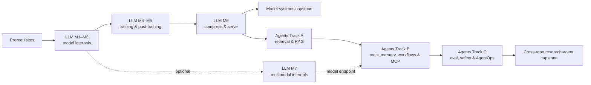

# LLMs-from-groundup — AI Engineer Enhancement Plan

**Repo:** `github.com/niket-sharma/LLMs-from-groundup`
**Goal:** Evolve the repo from a "small GPT from scratch" into a complete,
hands-on AI Engineer curriculum with two connected tracks:

1. **Model systems in this repository:** fundamentals → inference optimization →
   modern architectures → training/scaling → post-training → compression/serving
   → optional multimodal model internals.
2. **Applied AI systems in the companion repository
   [`AI-Agents-from-scratch`](https://github.com/niket-sharma/AI-Agents-from-scratch):** embeddings/retrieval/
   RAG → tools/agents/MCP → agent evaluation/observability/safety → production
   agent capstones.

The aim is not to reproduce every framework. It is to learn the durable ideas
underneath them, implement the important mechanisms once, and then use current
production libraries to understand the real engineering workflow.

**Execution model:** Each phase is a self-contained, agent-ready work unit with explicit files, acceptance criteria, and tests — designed to be driven by any coding agent (Claude Code, Codex, Cursor, Aider, Copilot Agent, etc.). See "Agent Execution Notes" for harness-agnostic conventions.
**Hardware budget:** 8 GB NVIDIA GPU, 32 GB RAM, WSL2/Ubuntu. Every experiment must run on this box (models ≤ ~125M params full-precision training; ≤ 7B for quantized inference).

## Curriculum Design Principles

1. **Mechanism before framework:** implement the smallest correct version in
   Python/PyTorch, then compare it with the production implementation.
2. **Evaluation before optimization:** define correctness and quality metrics
   before tuning speed, cost, prompts, retrieval, or training.
3. **Systems, not demos:** every model module covers failure modes, testing,
   profiling, reproducibility, latency/memory and limitations—not only the happy
   path. Applied-system reliability belongs in the companion agent repository.
4. **Evidence over checkboxes:** an item is complete only when its acceptance
   criterion is backed by a test, benchmark, eval result, or reproducible runbook.
5. **Local-first, API-optional:** tiny CPU paths run in CI; GPU and hosted-model
   experiments sit behind explicit flags and never block the core curriculum.
6. **Teach decisions:** each module explains when to use the technique, when not
   to use it, and how it connects to prompting, retrieval, fine-tuning, serving,
   or agent systems in the companion repository.
7. **Documentation ships with code:** every implementation change updates its
   corresponding material under `docs/`. A module is incomplete if a learner
   cannot understand, run, inspect, validate and test it from the documentation
   alone.

## Prerequisite Checkpoint — Python, ML, and Systems Foundations

This repo should not become a general Python or introductory ML course, but an
AI Engineer must be comfortable with the following before M1. Add a concise
`docs/prerequisites.md` plus executable exercises where the existing tutorials
do not already cover them:

- tensor shapes, broadcasting, matrix multiplication, numerical stability,
  probability distributions, cross-entropy, KL divergence, and perplexity;
- gradients, autograd, optimizers, regularization, train/validation/test splits,
  overfitting, leakage, and confidence intervals;
- Python packaging, typing, tests, profiling, async I/O, HTTP/JSON, SSE and
  WebSockets, processes/threads, queues, retries and timeouts;
- Linux/Git basics, GPU memory anatomy, reproducibility, experiment tracking,
  and reading profiler traces.

**Exit check:** implement a numerically stable softmax and cross-entropy, verify
their gradients against PyTorch, profile a tensor program, and build one small
async streaming client/server test. Learners who already know these can skip it.

---

## Current State Audit (updated 2026-08)

### What exists (keep and build on)
| Area | Files | Status |
|---|---|---|
| Repo foundation | `src/models/config.py`, `registry.py`, `Makefile`, CI | ✅ Config-driven factory, presets, common tooling |
| GPT architecture | `src/models/`, `modules/m1_fundamentals/` | ✅ MHA, learned/sinusoidal/RoPE, LayerNorm/RMSNorm, GELU/SwiGLU, QK-norm |
| Training | `src/training/{dataset,trainer}.py` | ✅ Char tokenizer, basic loop, grad clipping, LR scheduling |
| Tokenization | `modules/m1_fundamentals/bpe_tokenizer.py` | ✅ Byte BPE implementation and tests; full TinyStories acceptance run still pending |
| Inference | `src/utils/inference.py` | ✅ Temperature, top-k, top-p sampling (no KV cache) |
| Post-training (library-based) | `practical_llms/finetuning/` | ✅ SFT, LoRA, RLHF-TRL, PPO/DPO explainer, RLVR/GRPO explainer |
| API usage | `practical_llms/inference/` | ✅ OpenAI, Anthropic, HF local |
| Interpretability | `visualizations/`, `examples/visualize_llm.py` | ✅ Attention maps, embedding PCA, entropy |
| Tests | `tests/` | ✅ Models, training, utils |

### Gaps vs. the target AI Engineer curriculum
- **M1:** Core implementation exists; exact TinyStories 5k tokenizer benchmark,
  tokenizer loss comparison, specified 256→512 PE experiment, and trained-model
  attention analysis still need evidence; transformer-family comparison is new
- **M2:** 2.1 KV cache is implemented with parity tests and a CPU smoke benchmark;
  MQA/GQA/MLA, FlashAttention, PagedAttention, batching, speculative decoding,
  additional decoding and long-context experiments remain
- **M3:** Entirely missing — no MoE, SSM/Mamba, linear attention, diffusion LM
- **M4:** Minimal — char-level only, no real data pipeline, no packing, no mixed precision / grad accumulation / torch.compile, no scaling-law experiments
- **M5:** Good library coverage, but no **from-scratch** reward model / DPO / GRPO applied to the repo's own small GPT (the key differentiator)
- **M6:** Entirely missing — no quantization, distillation, serving stack, or benchmarking
- **M7 (optional):** Missing — no contrastive vision-language model, projection
  adapter, visual-token or multimodal model-internals curriculum
- **Companion boundary:** retrieval/RAG, structured outputs, tools, agents, MCP,
  agent memory, application evaluation, trace observability, human approval and
  application security are intentionally owned by `AI-Agents-from-scratch`
- **Integration:** Missing — no shared local-model interface, cross-repository
  learning map or capstone showing an agent consuming the model server built here

---

## Target Repo Structure (post-enhancement)

```
LLMs-from-groundup/
├── src/                          # existing core (refactored, backward compatible)
│   ├── models/                   # + rope.py, norms.py, gqa_attention.py, model registry
│   ├── training/                 # + bpe_tokenizer.py, packing, mixed precision
│   └── utils/
├── modules/
│   ├── m1_fundamentals/          # tokenizers, embeddings, attention deep dives
│   ├── m2_inference_opt/         # kv cache → speculative decoding
│   ├── m3_architectures/         # MoE, SSM, linear attention, diffusion LM
│   ├── m4_training_scaling/      # data pipelines, scaling laws
│   ├── m5_post_training/         # from-scratch RM/DPO/GRPO on small GPT
│   ├── m6_serving/               # quantization, distillation, vLLM, FastAPI
│   └── m7_multimodal_models/     # optional vision-language model internals
├── capstone/                     # train → evaluate → compress → serve a model
├── benchmarks/                   # shared benchmarking harness + results
├── notebooks/                    # one companion notebook per module
├── practical_llms/               # hosted/library counterparts linked from M5–M7
├── tests/                        # expanded per-module tests
└── docs/
    ├── prerequisites.md          # skippable Python/ML/systems checkpoint
    ├── modules/                  # canonical learning guides and runbooks M1–M7
    ├── interview_prep/           # distilled per-module interview Q&A
    └── decisions/                # architecture decision records
```

Each `modules/mX_*/` folder follows a standard contract:
```
mX_topic/
├── README.md          # concepts, math, diagrams (mermaid), interview questions
├── <topic>.py         # heavily-commented from-scratch implementation
├── benchmark.py       # measures the claimed improvement (speed/memory/quality)
└── test_<topic>.py    # correctness tests (parity vs reference implementation)
```

Larger training/serving modules may use a small package rather than one file,
but retain the same learning, correctness, benchmarking and documentation
contract.

## Documentation Contract — Required for Every Module

Every module owns a canonical guide at `docs/modules/mX_<topic>/`. The module
README is a concise landing page and links to these guides; it must not become a
second, divergent copy of the same documentation.

```text
docs/modules/mX_<topic>/
├── index.md             # learning goals, prerequisites, concept map, reading order
├── concepts.md          # intuition, math, shapes, algorithms, tradeoffs, diagrams
├── walkthrough.md       # source-guided implementation tour with symbol/file links
├── runbook.md           # setup and exact commands for tiny CPU, GPU and full runs
├── validation.md        # correctness claims, tolerances, evals and expected artifacts
└── troubleshooting.md   # common failures, diagnosis steps and fixes
```

Small modules may combine these into fewer files, but all required sections must
remain present and discoverable from `docs/modules/mX_<topic>/index.md`.

### Required content

1. **Understand it**
   - prerequisites and explicit learning objectives;
   - intuition first, then equations, tensor shapes and annotated diagrams;
   - a minimal worked example that can be followed by hand;
   - connections to earlier/later modules and a “when to use / not use” table;
   - source links to the exact implementation and tests being explained.
2. **Run it**
   - environment/setup requirements and optional dependencies;
   - copy-paste commands from repository root using Make targets where available;
   - tiny CPU command, optional GPU command and explicit `--full` command;
   - expected runtime, hardware/memory range, inputs, outputs and artifact paths;
   - how to stop, resume and clean up long-running experiments safely.
3. **Inspect and debug it**
   - a guided trace through the important functions, tensors and state changes;
   - assertions, logging/profiling hooks and one intentional failure exercise;
   - common symptoms, likely causes and diagnostic commands.
4. **Validate it**
   - the naive/reference baseline and the property being proven;
   - exact metric definitions, numerical tolerances and acceptance thresholds;
   - expected JSON/PNG/result-card fields and how to interpret them;
   - limitations, non-results and hardware-dependent claims clearly labeled.
5. **Test it**
   - exact unit, parity, integration, eval and benchmark commands;
   - what each test protects and what it does not prove;
   - expected pass/skip behavior on CPU-only CI;
   - instructions for reproducing a failed test with a fixed seed.
6. **Check learning**
   - exercises for explain, implement, measure, debug and choose;
   - 10+ interview questions with answers for the module;
   - a completion checklist linked to real tests/evals/artifacts.

### Documentation validation

- Add `make docs-check`, backed by `scripts/check_module_docs.py`, to verify
  required sections, valid local links, command snippets and referenced artifact
  paths without requiring network access.
- Every example command shown in docs must run in CI when marked `cpu-smoke`, or
  be syntax/config validated when marked `gpu`, `full` or `api`.
- Annotate executable command fences consistently, for example
  `<!-- run: cpu-smoke; cwd: repo-root; timeout: 60s -->`; allowed classes are
  `cpu-smoke`, `gpu`, `full`, `api`, `illustrative` and `manual`.
- Commands must state their working directory and must not depend on shell state
  left by an earlier example.
- Benchmark/eval scripts write metadata needed for reproducibility: timestamp,
  git revision, seed, config, device, dependency versions and command line.
- Documentation reviews are part of the same PR as implementation changes. No
  later “docs follow-up” is accepted for a completed module.

### Per-implementation definition of done

For every subsection (for example M2.1 or M7.3), the implementation PR must:

- update the relevant concept and walkthrough documentation;
- add or update exact run commands and their expected outputs;
- add correctness/parity tests before recording performance claims;
- add validation instructions tied to acceptance thresholds;
- run the documented CPU smoke path and record the command/output summary;
- update troubleshooting when a new dependency, failure mode or hardware caveat
  is introduced;
- update the module completion checklist and curriculum links;
- pass `make test`, `make lint`, `make docs-check` and the relevant benchmark or
  eval smoke target.

Code, tests, docs and evidence are one deliverable. Passing tests without an
updated learning guide is not completion; documentation without reproduced
commands and validation evidence is not completion either.

**Golden rule for every optimization module:** prove correctness first (output parity with the naive version within tolerance), then prove the win (benchmark numbers committed to `benchmarks/results/`).

---

## Phase 0 — Repo Foundation & Refactor (prerequisite, ~1 session)

**Why first:** every later phase plugs into a config-driven model factory; retrofitting later is painful.

### Tasks
1. **Config system:** Replace dict configs with a `GPTConfig` dataclass (`src/models/config.py`) with fields for every architectural knob added later: `pos_encoding: {"learned","sinusoidal","rope"}`, `norm: {"layernorm","rmsnorm"}`, `activation: {"gelu","swiglu"}`, `attention: {"mha","mqa","gqa"}`, `n_kv_heads`, `use_kv_cache`, `use_flash` (SDPA).
2. **Model registry:** `create_model(config)` factory; presets `tiny` (~1M), `small` (~10M), `base` (~50M), `gpt2-ish` (~124M).
3. **Repo hygiene:** `pyproject.toml` (replace setup.py/Pipfile duality), `ruff` + `pytest` config, GitHub Actions CI (lint + CPU tests), move `saved_models/tokenizer.pkl` and `lora_adapters/*.safetensors` out of git (or Git LFS) — binary artifacts don't belong in history.
   - **Harness-agnostic tooling:** add a `Makefile` (`test`, `bench-smoke`, `lint`, `format`, `docs-check` targets) as the single command surface every coding agent calls, and author `AGENTS.md` as the canonical agent instruction file. Add `scripts/sync_agent_docs.sh` to mirror it into `CLAUDE.md`, `.cursor/rules/`, `GEMINI.md`, `CONVENTIONS.md`, and `.github/copilot-instructions.md` so Claude Code, Codex, Cursor, Aider, Gemini CLI, and Copilot all read identical rules.
4. **Determinism utilities:** seed helper, device auto-detect (cuda/cpu), a `count_params()` / `estimate_flops()` helper used by all benchmarks.
5. **Top-level README rewrite:** curriculum map (M1–M7 + model capstone), learning
   path table, hardware requirements, and a prominent companion link explaining
   what continues in `AI-Agents-from-scratch`.

### Acceptance criteria
- [ ] `pytest tests/ -v` green on CPU
- [ ] Existing `examples/train_example.py` works unchanged (backward compat shim)
- [ ] `create_model(GPTConfig(preset="tiny"))` returns working model
- [ ] `make test` and `make bench-smoke` run green; `AGENTS.md` exists and syncs to the other harness files via `scripts/sync_agent_docs.sh`
- [ ] `make docs-check` validates required module documentation, local links and
  command annotations
- [ ] CI badge in README

---

## Module 1 — LLM Fundamentals (`modules/m1_fundamentals/`)

Deep-dive the pieces the current repo glosses over. Existing `src/` code is the baseline; M1 adds the "why" and the modern variants.

### 1.1 Tokenizers from scratch
**Files:** `bpe_tokenizer.py`, `tokenizer_comparison.py`
- Implement byte-level BPE from scratch (train + encode + decode + save/load), Karpathy-minbpe style but with regex pre-tokenization (GPT-2 pattern)
- Wire it into `src/training/dataset.py` as a drop-in alternative to the char tokenizer
- Comparison script: char vs BPE vs `tiktoken` vs SentencePiece on the same corpus — vocab size vs sequence length vs training loss tradeoffs
- Cover the classic gotchas in README: whitespace handling, number tokenization, why "strawberry" fails, byte fallback

### 1.2 Positional encodings
**Files:** `src/models/rope.py`, `modules/m1_fundamentals/positional_encodings.py`
- Implement sinusoidal PE and **RoPE** from scratch (with clear complex-number and rotation-matrix derivations in comments)
- Add both to `GPTConfig`; RoPE becomes the default for all later modules
- Include NTK-aware / linear position interpolation for context extension (needed later for long-context discussion)
- Experiment: train tiny model with learned vs sinusoidal vs RoPE on sequences of length 256, evaluate perplexity extrapolation at length 512

### 1.3 Modern block components
**Files:** `src/models/norms.py` (RMSNorm), SwiGLU in `feedforward.py`
- RMSNorm from scratch + why it replaced LayerNorm (compute, no mean-centering)
- SwiGLU FFN (with the 2/3·4d hidden-dim convention explained)
- QK-norm option (used in recent models for stability)

### 1.4 Attention anatomy
**Files:** `attention_deep_dive.py` (extends existing visualizations)
- Single-head → multi-head step-by-step with shape annotations at every line
- Attention-sink and entropy analysis on the trained model (extend existing `visualize_llm.py`)
- Causal mask variants: additive -inf vs boolean, sliding-window mask (foreshadows Mistral-style local attention)

### 1.5 Transformer families and objectives
**Files:** `transformer_families.py`
- Decoder-only causal LM vs encoder-only masked LM vs encoder-decoder sequence-to-
  sequence model; bidirectional/self/cross-attention masks and loss functions
- Implement minimal encoder and encoder-decoder reference paths reusing the same
  attention primitives; these are educational references, not competing GPT
  registry architectures
- Compare where each family is useful: generation, embeddings/classification,
  retrieval/reranking, translation/summarization and multimodal adapters
- Explain causal language modeling, masked modeling, span corruption and
  sequence-to-sequence teacher forcing

### Acceptance criteria
- [ ] BPE tokenizer round-trips arbitrary UTF-8 (`decode(encode(s)) == s`) and trains a 5k vocab on TinyStories subset in < 5 min
- [ ] RoPE model matches learned-PE model's loss within noise on short seqs, beats it on length extrapolation (plot committed)
- [ ] All new components covered by parity/shape tests
- [ ] README has 10+ interview questions with answers per subsection
- [ ] Decoder, encoder and encoder-decoder mask/shape tests pass; a learner can
  trace where cross-attention keys and values originate

---

## Module 2 — Inference Optimization (`modules/m2_inference_opt/`)

**The highest-value module for AI Engineer interviews.** Build the full modern inference stack incrementally, benchmarking each step on the same ~50M model.

**Progress:** 2.1 KV cache is implemented. The remaining subsections stay open
until their own parity tests, documentation and benchmarks are committed.

### 2.1 KV cache from scratch
**Files:** `kv_cache.py`, refactor `src/utils/inference.py`
- Naive generation (recompute everything) vs cached generation; both must produce identical tokens (greedy)
- Static pre-allocated cache vs dynamic append; measure memory with `torch.cuda.max_memory_allocated()`
- Benchmark: tokens/sec vs sequence length — the O(n²) → O(n) chart is the money plot

### 2.2 MQA / GQA / MLA
**Files:** `src/models/gqa_attention.py`, `modules/m2_inference_opt/attention_variants.py`
- Extend attention to `n_kv_heads < n_heads` (MQA = 1 kv head, GQA = groups)
- **MLA (Multi-head Latent Attention, DeepSeek-V2/V3):** implement the low-rank KV compression version — even a simplified educational variant — with the KV-cache-size math worked out in comments
- Benchmark: KV cache bytes per token for MHA vs GQA(4) vs MQA vs MLA at various model sizes (table, not just measured — derive the formula)

### 2.3 FlashAttention (use + understand)
**Files:** `flash_attention.py`
- Swap manual attention for `F.scaled_dot_product_attention` and benchmark backends (math / mem-efficient / flash) — this is the practical path on an 8 GB card
- Educational: implement **tiled/online-softmax attention in pure PyTorch** (the FlashAttention algorithm, not the CUDA kernel) to show why it's memory-O(n) — verify parity with naive attention
- Optional stretch: a minimal Triton attention kernel (guarded by `try: import triton`)

### 2.4 Continuous batching + PagedAttention (simulator)
**Files:** `batching_simulator.py`, `paged_attention.py`
- Static batching vs continuous batching **discrete-event simulator**: requests arrive with Poisson arrivals, varying prompt/output lengths; measure throughput, TTFT, p50/p99 latency. This is a simulation — no GPU needed — and it's exactly the mental model vLLM interviews probe
- PagedAttention: implement block-table KV memory manager (block allocation, freeing, copy-on-write for beam/prefix sharing) over the from-scratch KV cache; measure fragmentation vs contiguous allocation
- Prefix caching demo: shared system prompt across requests

### 2.5 Speculative decoding
**Files:** `speculative_decoding.py`
- Two-model implementation: `tiny` (draft) + `base` (target) from the repo's own registry
- Full rejection-sampling acceptance rule (with the proof sketch in comments that output distribution is unchanged)
- Benchmark: acceptance rate and wall-clock speedup vs draft length k
- Bonus: self-speculative / n-gram (prompt lookup) decoding — no draft model needed

### 2.6 Decoding strategies (round out existing sampling)
**Files:** extend `src/utils/inference.py`
- Add: min-p, beam search, repetition penalty, logit bias, structured/constrained decoding via a tiny JSON grammar mask (foreshadows tool calling)

### 2.7 Long context and inference-time compute
**Files:** `long_context.py`, `inference_time_compute.py`
- Measure prefill vs decode separately; demonstrate prompt/prefix caching and the
  latency/cost benefit of reused context
- Long-context failure probes: lost-in-the-middle, distractor sensitivity,
  context truncation, sliding-window behavior, and context compression
- Implement self-consistency / best-of-N with a verifier on a toy reasoning
  task; plot quality vs generated-token compute and explain why more inference
  compute is useful only when selection is reliable
- Explain—but do not require local implementation of—prefill/decode
  disaggregation and tensor-parallel serving

### Acceptance criteria
- [ ] KV-cached greedy output token-identical to naive; ≥ 5× speedup at 512 tokens on the 50M model
- [ ] GQA model trains to comparable loss vs MHA at equal params (short run)
- [ ] Tiled attention matches naive within 1e-4; SDPA-flash benchmark table committed
- [ ] Batching simulator reproduces the known result: continuous batching ≥ 2–3× throughput vs static at high load
- [ ] Speculative decoding provably distribution-preserving (statistical test on sampled outputs) with measured speedup > 1.3×
- [ ] Prefix caching reduces repeated-prompt prefill time; long-context eval and
  quality-vs-compute curves committed

---

## Module 3 — Modern Model Architectures (`modules/m3_architectures/`)

### 3.1 Mixture of Experts
**Files:** `moe.py`, `moe_training.py`
- Replace FFN with MoE layer: top-k router, softmax gating, capacity factor, token dropping
- Load-balancing auxiliary loss (Switch-style) + router z-loss; log expert utilization histograms
- Train a tiny MoE (8 experts, top-2) vs dense FLOP-matched baseline on TinyStories; show the active-params vs total-params distinction
- README: expert parallelism concepts, why MoE inference is memory-bound, shared experts (DeepSeek), fine-grained experts

### 3.2 State-space models
**Files:** `ssm_mamba.py`
- Minimal Mamba-style selective SSM block from scratch (sequential scan for clarity + parallel scan for the "how it's fast" story)
- S4 → Mamba lineage explained; recurrent vs convolutional vs parallel-scan views
- Train tiny SSM LM vs tiny transformer at matched params; benchmark inference: constant memory per token vs growing KV cache (the key selling point)

### 3.3 Linear & hybrid attention
**Files:** `linear_attention.py`
- Kernel-trick linear attention from scratch (the (QKᵀ)V → Q(KᵀV) associativity insight, with the O(n²d) → O(nd²) math)
- Sliding-window attention implementation; hybrid layer stacking (e.g., 3 local : 1 global — Gemma/GPT-OSS pattern)
- Brief README coverage of GLA / RWKV / RetNet family as decay-augmented linear attention

### 3.4 Diffusion language models
**Files:** `diffusion_lm.py`
- Masked discrete diffusion (MDLM/LLaDA-style) tiny model: train with random masking ratios, iterative parallel decode
- Side-by-side generation demo: autoregressive left-to-right vs diffusion any-order infilling
- README: why diffusion LMs promise fast parallel generation, current tradeoffs

### Acceptance criteria
- [ ] MoE tiny model trains stably (no expert collapse — utilization plot committed) and beats FLOP-matched dense baseline
- [ ] SSM generates coherent text at tiny scale; memory-vs-length benchmark chart committed
- [ ] Linear attention parity test vs softmax attention on short sequences (approximation error quantified)
- [ ] Diffusion LM produces a working infilling demo notebook

---

## Module 4 — Training, Data & Scaling (`modules/m4_training_scaling/`)

### 4.1 Modern training loop upgrades (into `src/training/trainer.py`)
- Mixed precision (`torch.amp`, bf16), gradient accumulation, gradient checkpointing (needed to train 124M on 8 GB)
- `torch.compile` toggle + speedup benchmark
- Cosine and **WSD (warmup-stable-decay)** LR schedules; AdamW with proper weight-decay grouping (no decay on norms/embeddings); optional Muon optimizer for the projection matrices (2025-era standard, great interview talking point)
- Checkpoint/resume (model + optimizer + scheduler + RNG state), W&B or simple CSV/TensorBoard logging

### 4.2 Data pipeline
**Files:** `data_pipeline.py`
- Streaming dataset from HF (`datasets` streaming) → tokenize → **sequence packing** with document-boundary attention masking (vs the current naive chunking)
- Data quality mini-pipeline: dedup (MinHash sketch on a small corpus), heuristic filters, contamination check against an eval set
- Synthetic data generation script: use `practical_llms/inference/anthropic_api.py` to generate instruction data (bridges to M5); cover self-instruct / distillation-as-data concepts in README

### 4.3 Scaling laws lab
**Files:** `scaling_laws.py`
- Train a grid of ~5 model sizes (1M → 30M) × token budgets on TinyStories, fit `L(N, D) = E + A/N^α + B/D^β`
- Reproduce the Chinchilla insight at toy scale: compute-optimal N:D ratio plot; IsoFLOP curves
- README: Kaplan vs Chinchilla, why frontier labs overtrain (inference-optimal vs compute-optimal), data-constrained scaling

### 4.4 Objectives beyond next-token
**Files:** `objectives.py`
- Fill-in-the-middle (FIM) training transform (code-model staple), and multi-token prediction head (DeepSeek-V3-style) as an optional experiment

### 4.5 Distributed-training literacy
**Files:** `distributed_training.py`, `distributed_training.md`
- Derive memory and communication costs for data, tensor, pipeline, sequence,
  context and expert parallelism; explain all-reduce, all-gather and
  reduce-scatter
- Run a tiny CPU/multi-process DDP parity demo in CI and an optional single-node
  multi-GPU DDP/FSDP exercise when hardware is available
- Compare ZeRO/FSDP sharding stages conceptually; cover sharded checkpointing,
  failure recovery, deterministic data sampling and stragglers
- Include a decision table: single GPU vs DDP vs FSDP/ZeRO vs tensor/pipeline
  parallelism. Do not pretend the repo's 8 GB single-GPU setup proves scale-out
  performance

### Acceptance criteria
- [ ] 124M model trains on the 8 GB GPU (bf16 + grad checkpointing + accumulation) without OOM — document the exact recipe
- [ ] Packing improves tokens/sec ≥ 20% vs padded batching (measured)
- [ ] Scaling-law fit produces sane exponents and a compute-optimal frontier plot committed to `benchmarks/results/`
- [ ] Full train → checkpoint → kill → resume test passes bit-exact loss continuation
- [ ] Two-process CPU DDP matches single-process gradients within tolerance;
  distributed memory/communication worksheet is tested

---

## Module 5 — Post-Training & Alignment (`modules/m5_post_training/`)

**Strategy:** `practical_llms/` already does this with TRL. M5's differentiator is doing it **from scratch on the repo's own small GPT** so every gradient is visible. Keep TRL versions as "production" counterparts and cross-link.

### 5.1 SFT from scratch
**Files:** `sft_from_scratch.py`
- Chat template design (special tokens added to the BPE tokenizer), **loss masking on prompt tokens**, packing chat examples
- Fine-tune the pretrained small GPT on a tiny instruction set (synthetic data from M4.2)

### 5.2 Parameter-efficient fine-tuning from scratch
**Files:** `peft_from_scratch.py`
- LoRA update `W + BA`, rank/alpha scaling, initialization, dropout, target-module
  choice, trainable-parameter accounting, merge/unmerge and adapter loading
- Compare full fine-tuning vs LoRA at matched data; cover QLoRA/NF4 interaction,
  DoRA and prompt/prefix tuning conceptually
- Demonstrate adapter composition and its limits; test that merging preserves
  outputs and never silently changes the frozen base weights

### 5.3 Reward modeling
**Files:** `reward_model.py`
- Bradley–Terry pairwise loss reward model: small GPT + scalar head trained on preference pairs
- Evaluate: accuracy on held-out preferences; demonstrate reward hacking with a length-bias probe

### 5.4 DPO from scratch
**Files:** `dpo_from_scratch.py`
- Full DPO loss implementation (policy + frozen reference, log-ratio derivation in comments), β sweep
- Implicit-reward accuracy tracking; compare against TRL DPO on the same data (sanity parity)
- README: DPO vs PPO tradeoffs, IPO/KTO/SimPO/ORPO variants (implement SimPO as a ~20-line diff — reference-free)

### 5.5 GRPO / RLVR from scratch
**Files:** `grpo_from_scratch.py`
- GRPO on a **verifiable task**: arithmetic (e.g., 2–3 digit addition) so the tiny model can actually improve — group sampling, group-relative advantage (no value network), KL penalty to reference, clipped surrogate
- Log reward curves + sample completions over training; discuss reward format (correctness + format rewards, DeepSeek-R1-Zero style)
- README: PPO vs GRPO diagram, why RLVR sidesteps reward-model hacking, entropy collapse / KL control failure modes; note DAPO/GSPO refinements

### 5.6 Evaluation harness
**Files:** `evals.py`
- Perplexity eval, a tiny MC-accuracy eval (logit-based), LLM-as-judge pairwise win-rate script (Claude API) for SFT-vs-DPO checkpoints
- README: eval contamination, why leaderboard deltas mislead

### 5.7 Reasoning, verifiers, and data flywheels
**Files:** `verifiers.py`, `reasoning_data.py`
- Outcome vs process supervision; executable/verifiable rewards for math, code,
  and structured tasks; calibration and false-positive failure modes
- Rejection sampling and best-of-N data generation, filtering, deduplication,
  difficulty balancing, and iterative train → generate → verify → retrain loops
- Compare prompting, RAG, SFT and preference/RL post-training on the same small
  task so learners practice choosing the least complex intervention that works
- Discuss when chain-of-thought should remain latent/private; evaluate final
  answers and tool traces without requiring models to expose hidden reasoning

### Acceptance criteria
- [ ] SFT model follows a basic chat format where the base model doesn't (qualitative samples committed)
- [ ] LoRA merge/unmerge parity passes and the result card compares trainable
  parameters, peak memory, speed and held-out quality against full fine-tuning
- [ ] Reward model > 70% held-out preference accuracy on toy data
- [ ] DPO from scratch matches TRL DPO loss curve shape on identical data
- [ ] GRPO measurably improves arithmetic accuracy (e.g., 20% → 60%+) with reward curve committed
- [ ] Judge-based win rate: DPO checkpoint > SFT checkpoint
- [ ] Verifier precision/recall measured; one data-flywheel iteration improves a
  held-out task without contaminating its eval set

---

## Module 6 — Compression & Serving (`modules/m6_serving/`)

### 6.1 Quantization from scratch
**Files:** `quantization.py`
- Implement absmax and zero-point INT8 quantization of the small GPT's linear layers; per-tensor vs per-channel vs group-wise; measure perplexity degradation at INT8/INT4
- GPTQ intuition (error-compensating rounding) explained + a simplified implementation on one layer; AWQ activation-aware scaling concept
- Practical track: QLoRA/NF4 via bitsandbytes on a 1–3B HF model (fits the 8 GB card), GGUF conversion + llama.cpp/**Ollama** run (ties into the existing Ollama/Qwen local setup)
- README: PTQ vs QAT, FP8/MXFP4 trend, KV-cache quantization

### 6.2 Distillation
**Files:** `distillation.py`
- Logit distillation (KL on soft targets, temperature) of `base` → `tiny` from the repo registry; compare vs training tiny from scratch on same tokens
- README: sequence-level/on-policy distillation (GKD), distillation-as-synthetic-data (link to M4.2)

### 6.3 Serving stack
**Files:** `serve_fastapi.py`, `serve_vllm.md`, `client_bench.py`
- FastAPI server around the from-scratch model: streaming SSE, request queueing, the continuous-batching engine from M2.4 wired into a real server loop (this is the capstone integration)
- vLLM hands-on: serve a small quantized model (e.g., Qwen2.5-1.5B) on the 8 GB card; document PagedAttention/prefix-cache flags observed vs the M2 simulator
- OpenAI-compatible endpoint shape; note TGI/SGLang/TensorRT-LLM landscape in README

### 6.4 Benchmarking & deployment economics
**Files:** `benchmarks/harness.py`
- Unified load-test client: TTFT, ITL/TPOT, throughput vs concurrency curves against (a) from-scratch FastAPI server, (b) vLLM
- README: prefill vs decode phases (compute-bound vs memory-bound), roofline intuition, batch-size/latency tradeoff, cost-per-million-tokens estimation, GPU memory budgeting formula (weights + KV + activations)

### 6.5 Production API and reliability engineering
**Files:** `production_api.py`, `deployment.md`, `test_resilience.py`
- Async request lifecycle, streaming cancellation, bounded queues, backpressure,
  timeouts, retries with jitter, idempotency and circuit breakers
- Authentication, tenant quotas, rate limiting, request-size/token budgets,
  model routing and graceful overload behavior
- Container image, health/readiness probes, configuration/secrets handling and a
  local deployment recipe; explain autoscaling and GPU scheduling without
  requiring Kubernetes
- Safe rollout concepts: model/prompt versioning, shadow traffic, canary/A-B
  tests, rollback, SLOs and incident runbooks

### Acceptance criteria
- [ ] INT8 from-scratch quantization: < 5% perplexity degradation, memory halved (measured)
- [ ] Distilled tiny beats from-scratch tiny at equal token budget
- [ ] FastAPI server with continuous batching sustains concurrent streaming clients; benchmark JSON committed
- [ ] vLLM serving a quantized 1.5B model documented end-to-end for WSL2 + 8 GB, with harness numbers vs the from-scratch server
- [ ] Load test demonstrates bounded memory under overload, cancellation frees
  resources, rate limits work, and latency/error SLOs are reported

---

## Cross-Repository AI Engineer Curriculum

The two repositories should be presented as a sequence, not competitors:

| Layer | Owner | Question answered |
|---|---|---|
| Tokenization, transformer blocks, architecture | `LLMs-from-groundup` | How does the model compute? |
| Training, scaling, post-training, compression | `LLMs-from-groundup` | How is model behavior learned and changed? |
| Inference engine and model serving | `LLMs-from-groundup` | How does the model generate efficiently? |
| Embeddings, search, reranking and RAG | `AI-Agents-from-scratch` | How does an application supply external knowledge? |
| Structured output, tools, memory, planning and MCP | `AI-Agents-from-scratch` | How does a model take reliable actions? |
| Agent evaluation, traces, approval and application safety | `AI-Agents-from-scratch` | How is the complete AI system validated and operated? |



### Integration contract

- M6 exposes a small OpenAI-compatible HTTP/SSE endpoint and publishes a client
  example, schema, capability metadata and model result card.
- `AI-Agents-from-scratch` consumes that endpoint through a provider-neutral LLM
  interface; the same agent eval can run against the local model and a hosted
  model without changing agent logic.
- Repositories never import each other's source through filesystem-relative
  paths. Integration occurs through documented protocols and versioned fixtures.
- Both top-level READMEs show the same two-repository curriculum diagram and link
  to the exact handoff tutorial.
- Each cross-link states prerequisites, expected hardware/API cost and which
  repository owns issues and acceptance criteria.
- Model evals stay here; retrieval, tool-trace and end-to-end agent evals stay in
  the companion repo. Shared tasks may reuse versioned JSON schemas/fixtures, but
  each repository tests its side of the interface independently.

### Companion-repository foundation work

`AI-Agents-from-scratch` already has useful tutorials for basic agents, memory,
tools, MCP, planning, frameworks, subagents and RAG-vs-agentic comparison. Before
adding more breadth, its plan should:

1. replace the placeholder `LEARNING_ROADMAP.md` with Companion Tracks A–C below;
2. reconcile the stale `PROJECT_STATUS.md` with the files and tests that exist;
3. add a canonical instruction file, `pyproject.toml`, Make targets and CI;
4. consolidate duplicated tutorial logic behind small tested interfaces without
   hiding the from-scratch learning steps;
5. adopt the same understand/run/inspect/validate/test/troubleshoot docs contract;
6. add the local-model handoff tutorial and cross-repository research-agent
   capstone.

## Companion Track A — Embeddings, Retrieval & RAG

**Owner:** [`AI-Agents-from-scratch`](https://github.com/niket-sharma/AI-Agents-from-scratch),
extending its existing `tutorials/rag-vs-agentic/` implementation and benchmark.
This section is a cross-repository interface contract, not a module to implement
in `LLMs-from-groundup`.

This is the largest gap between the original roadmap and day-to-day AI
engineering. Build retrieval bottom-up, then use a production vector store only
after the metrics are understood.

### 7.1 Embeddings and semantic similarity
**Files:** `embeddings.py`, `benchmark_embeddings.py`
- Implement mean-pooled text embeddings and contrastive/InfoNCE training on a
  tiny paired dataset; cosine vs dot-product vs L2 and the role of normalization
- Dense vs sparse representations; BM25 from scratch and why lexical search is
  still essential for names, identifiers, numbers and exact phrases
- Embedding anisotropy, dimensionality, pooling, truncation, multilingual
  behavior and domain shift
- Evaluate retrieval with Recall@k, Precision@k, MRR and nDCG—not by eyeballing
  generated answers

### 7.2 Indexes and hybrid search
**Files:** `vector_index.py`, `hybrid_search.py`
- Exact nearest-neighbor search, then an educational HNSW or IVF implementation;
  explain product quantization and the recall/latency/memory tradeoff
- Hybrid BM25+dense retrieval with score normalization and reciprocal-rank
  fusion; metadata filters and access-control filters
- Cross-encoder reranking, diversity/MMR and query expansion/decomposition
- Compare the from-scratch index with one lightweight production option
  (FAISS, sqlite-vec, pgvector or Qdrant) without making the curriculum depend
  on an external service

### 7.3 Ingestion, chunking and provenance
**Files:** `ingestion.py`, `chunking.py`
- Parse Markdown/HTML/PDF-like fixtures, normalize text, preserve headings,
  tables and source spans, hash content, deduplicate and update incrementally
- Fixed, recursive, semantic and structure-aware chunking; parent-child chunks
  and small-to-big retrieval
- Versioned document/index schemas, deletion, freshness, source licensing and
  personally identifiable information handling
- Demonstrate how chunking choices alter retrieval recall and context cost

### 7.4 Grounded generation and advanced RAG
**Files:** `rag_pipeline.py`, `rag_evals.py`
- Query → retrieve → rerank → pack context → answer with source citations;
  citation spans must resolve to retrieved source text
- Context budgeting, duplicate removal, lost-in-the-middle mitigation, query
  rewriting, multi-query retrieval and decomposition for multi-hop questions
- Abstention when evidence is insufficient; distinguish retrieval failure from
  generation/faithfulness failure
- Cover—but keep optional—graph RAG, late-interaction retrieval, multimodal RAG
  and agentic retrieval. Complexity must earn an eval improvement

### Acceptance criteria
- [ ] BM25 and exact dense-search parity tests pass against a trusted reference
- [ ] Hybrid retrieval beats either BM25 or dense alone on a versioned local
  eval set; Recall@k/MRR/nDCG and confidence intervals are committed
- [ ] Approximate index reports recall/latency/memory tradeoffs, not latency alone
- [ ] RAG answers have mechanically valid citations, abstain on unanswerable
  questions, and beat a no-retrieval baseline on grounded correctness
- [ ] Prompt-injected documents cannot cause tool execution or override system
  policy in the companion retrieval threat-model test

---

## Companion Track B — Tool Use, Workflows & Agents

**Owner:** `AI-Agents-from-scratch`, consolidating its existing basics, memory,
tools, MCP, planning, framework and subagent tutorials behind tested core
interfaces. This section is not implemented in `LLMs-from-groundup`.

The learning goal is not “use an agent framework.” It is to understand the
control loop, state, tool contracts, failure recovery and security boundaries
that every framework eventually has to implement.

### 8.1 Prompt and context engineering
**Files:** `prompting.py`, `context_budget.py`
- System/developer/user/tool instruction hierarchy, few-shot examples, prompt
  templates, delimiters, context budgeting and cache-friendly prompt layout
- Structured output with JSON Schema, validation, repair and constrained
  decoding; separate generated data from instructions
- Prompt versioning and regression tests; compare direct prompting, few-shot,
  decomposition and retrieval using the same eval set
- Teach that prompt injection is an authorization problem, not a string-filter
  problem

### 8.2 Tool calling from scratch
**Files:** `tool_loop.py`, `tools.py`
- Provider-neutral tool schema, selection, argument validation, execution,
  result serialization and iterative model/tool loop
- Sync/async tools, parallel calls, timeouts, retries, idempotency, pagination,
  cancellation and partial failure
- Least privilege, allowlists, sandboxing, output-size limits, provenance and
  human approval before consequential actions
- Deterministic workflow vs model-directed agent: use the workflow when the
  control flow is known

### 8.3 State, memory and durable execution
**Files:** `state_machine.py`, `memory.py`, `durable_agent.py`
- Explicit state machines/DAGs, checkpoints, resumability and exactly-once vs
  at-least-once side-effect semantics
- Conversation state, summaries, semantic memory and episodic records; measure
  retrieval quality and stale/incorrect-memory harm
- Planning, reflection and multi-agent patterns as optional experiments; require
  evidence before adding agents or extra model calls
- Human-in-the-loop interrupts, audit log and replayable traces

### 8.4 MCP interoperability
**Files:** `mcp_server.py`, `mcp_client.py`
- Implement a minimal local MCP server/client exercise covering tools,
  resources, prompts, capability discovery and lifecycle
- Compare stdio and Streamable HTTP conceptually; authentication and consent for
  remote servers; trust boundaries between host, client and server
- Treat MCP output as untrusted data and demonstrate an indirect prompt-
  injection attempt from a malicious resource/tool response

### 8.5 Agent evaluation
**Files:** `agent_evals.py`
- Task success, tool-selection accuracy, argument accuracy, step count, latency,
  token/cost budget, unsafe-action rate and recovery from injected failures
- Evaluate final state and tool trace, not only final prose; include deterministic
  simulators for email/calendar/database-style tools
- Compare single-shot, deterministic workflow and agent loop on the same tasks

### Acceptance criteria
- [ ] Structured outputs validate against schema across the full eval set
- [ ] Tool loop survives timeout, malformed arguments, duplicate delivery and
  partial failure without duplicating side effects
- [ ] Consequential tools require approval and enforce least-privilege scopes
  outside the prompt/model
- [ ] MCP demo interoperates with a reference client or server and passes an
  indirect-prompt-injection test
- [ ] Agent result card reports quality, unsafe-action rate, latency and cost vs
  a deterministic workflow baseline

---

## Companion Track C — Agent Evaluation, Safety & AgentOps

**Owner:** `AI-Agents-from-scratch`. Model-quality evaluation, training
reproducibility and inference-server telemetry remain in M4–M6 here; end-to-end
agent traces, prompt/tool regressions, human approval and application threat
models belong in the companion repository.

Evaluation is introduced throughout both repositories; this companion track
turns agent/application evaluation into a reusable production discipline
spanning offline experiments, traces and online behavior.

### 9.1 Evaluation engineering
**Files:** `eval_core.py`, `graders.py`, `datasets.py`
- Versioned eval datasets and schemas; golden sets, adversarial slices,
  counterfactuals, hard negatives and train/eval contamination controls
- Deterministic exact/execution/schema graders before model-based graders;
  pairwise and rubric-based LLM judges only where needed
- Calibrate judges against blinded human labels; position/verbosity bias,
  inter-rater agreement, uncertainty, bootstrap confidence intervals and
  significance testing
- Component evals for retrieval/tool use plus end-to-end evals; error taxonomy
  and slice-based analysis

### 9.2 Tracing and observability
**Files:** `tracing.py`, `dashboard.py`
- Trace model, retrieval and tool spans with correlation IDs, versions, timing,
  token counts, cache hits, retries, errors and estimated cost
- Structured logs, metrics and traces; redaction and sampling; dashboards for
  TTFT, latency percentiles, success rate, groundedness and spend
- Dataset creation from production feedback with privacy review; detect drift
  in queries, retrieval and outcome metrics
- Optional OpenTelemetry-compatible export while retaining a local JSONL path

### 9.3 Security, privacy and red teaming
**Files:** `threat_model.md`, `red_team.py`, `guardrails.py`
- Threat-model data flow and trust boundaries; direct/indirect prompt injection,
  sensitive-data disclosure, insecure output handling, poisoning, supply-chain
  risk, vector/index weaknesses, excessive agency and unbounded consumption
- Authorization and policy checks in deterministic code; tenant isolation,
  secret/PII handling, encryption concepts, retention/deletion and audit logs
- Input/output validation, content moderation where appropriate, sandboxed code
  execution and egress controls; document residual risk and false positives
- Bias and performance slices, accessibility, provenance/copyright constraints,
  model/system cards and honest communication of uncertainty and limitations
- Build adversarial tests from the threat model and run them in CI

### 9.4 Experimentation and lifecycle
**Files:** `experiment_runner.py`, `model_registry.py`, `release_gate.py`
- Version models, adapters, tokenizers, prompts, tools, indexes, data and evals as
  one deployable system configuration
- Reproducible experiment manifests, baseline comparisons and quality/latency/
  cost release gates
- Shadow evaluation, canary/A-B tests, user feedback, rollback and post-incident
  eval additions; avoid optimizing online metrics without guardrails
- Provider/model routing and fallback based on capability, privacy, latency,
  reliability and cost rather than one aggregate benchmark score

### Acceptance criteria
- [ ] A single command compares two full system versions and produces a
  slice-level result card with confidence intervals
- [ ] LLM judge agreement is measured against human labels and fails closed when
  calibration drops below the documented threshold
- [ ] Traces join generation, retrieval and tool spans without logging secrets or
  raw sensitive fixtures
- [ ] Red-team suite covers direct/indirect injection, data exfiltration,
  cross-tenant access, unsafe tool use and resource exhaustion
- [ ] Result card includes relevant subgroup/performance slices and documents
  intended use, unsupported use, data provenance and residual risk
- [ ] Release gate blocks a deliberately regressed prompt/model/index version

---

## Module 7 — Multimodal Model Internals (`modules/m7_multimodal_models/`)

Multimodality is an optional model-engineering specialization after the text
model track. This repository teaches representation learning, model adapters,
cross-attention and multimodal training. Multimodal RAG, realtime agent
orchestration and application safety continue in `AI-Agents-from-scratch`.

### 7.1 Vision-language foundations
**Files:** `vision_language.py`
- Image patches and vision encoders; contrastive image-text learning (CLIP-style)
  and projection/adaptor layers into a language model
- Implement a tiny contrastive dual encoder and retrieval demo; inspect failure
  cases, embedding alignment and modality imbalance
- Explain early/late fusion, cross-attention, visual token budgets and why OCR,
  layout and charts need specialized evaluation

### 7.2 Vision-language adapters and generation
**Files:** `vlm_adapter.py`, `cross_attention.py`
- Connect a frozen tiny vision encoder to the repo language model through a
  learned projection/resampler; compare prefix visual tokens with cross-attention
- Implement a tiny image-caption or visual-question task with synthetic/local
  fixtures; trace shapes from pixels → patches → visual tokens → text logits
- Compare full fine-tuning, frozen towers and adapter-only training in parameter,
  memory and quality terms
- Explain early/late fusion, cross-attention, visual token budgets and why OCR,
  layout and charts require specialized encoders and evaluation

### 7.3 Multimodal training and model evaluation
**Files:** `multimodal_dataset.py`, `multimodal_evals.py`
- Paired-data construction, augmentations, batching variable image sizes,
  contrastive/generative objectives and modality balancing
- Evaluate retrieval, captioning and question answering separately; distinguish
  perception, alignment and language-reasoning failures
- Probe visual hallucination, text-only shortcuts and distribution shift; report
  slices rather than one aggregate score
- Data licensing, image privacy and dataset provenance at the model-training layer

### 7.4 Speech-model internals (optional)
**Files:** `speech_models.py`
- Spectrogram/features vs learned audio codecs; encoder-decoder ASR, CTC and
  autoregressive audio-token modeling at an educational level
- Chunked/streaming encoder state and latency-quality tradeoffs; model parity on
  synthetic waveforms without building a full voice-agent product
- Cross-link the realtime ASR → agent → TTS system exercise in the companion repo

### Acceptance criteria
- [ ] Tiny contrastive model retrieves paired image/text examples above random
  baseline with Recall@k reported
- [ ] Vision adapter produces correctly shaped language-model inputs; frozen and
  merged components receive exactly the intended gradients
- [ ] Model-eval slices separate perception, alignment and language failures and
  include a text-only shortcut baseline
- [ ] Optional streaming speech model matches full-context output within the
  documented tolerance on synthetic fixtures

---

## Model-Systems Capstone — Train, Optimize & Serve (`capstone/`)

Build one coherent model lifecycle rather than another isolated demo: train a
tiny modern GPT from a versioned dataset, resume deterministically, evaluate it,
post-train or distill it, quantize it and serve it through the M6 endpoint.

Required integrations:

- M1 tokenizer and modern transformer configuration;
- M2 cached/optimized inference and measured decoding behavior;
- M4 reproducible training, checkpointing, data and scaling instrumentation;
- M5 one evidence-backed post-training or distillation decision;
- M6 quantization, streaming serving, load testing and model-server telemetry;
- optional M7 multimodal adapter behind a feature flag.

**Model-capstone acceptance:** one manifest reproduces data/model/training/eval
configuration; quality is measured before and after post-training/compression;
the server reports latency, throughput and memory under concurrency; a result
card documents limitations and the exact handoff interface for agent clients.

### Cross-repository capstone — Evidence-grounded research agent

The companion `AI-Agents-from-scratch` capstone consumes either this repo's
OpenAI-compatible local server or a hosted provider through the same interface.
It owns hybrid retrieval, citations, read-only tools, durable workflow state,
approval boundaries, trace evaluation, prompt-injection tests and application
SLOs. This proves that the two repositories form one curriculum without mixing
model implementation and agent-application concerns.

---

## Cross-Cutting Deliverables

1. **`docs/modules/`** — canonical per-module concept guides, implementation
   walkthroughs, runbooks, validation instructions and troubleshooting; updated
   in the same PR as each implementation
2. **`docs/interview_prep/`** — per-module Q&A distilled from the canonical guides
   (feeds your existing Elo interview-agent tooling in `ai-engineer-wiki`)
3. **`notebooks/`** — one runnable companion notebook per module (jupytext-paired, consistent with your dsa-python-lab pattern)
4. **`benchmarks/results/`** — every benchmark commits machine-readable JSON and
   an appropriate visualization plus a result card covering correctness,
   quality, latency/memory and limitations
5. **`evals/`** — small, versioned, license-documented local datasets and graders;
   generated data must record provenance and remain separate from held-out evals
6. **`docs/decisions/`** — short architecture decision records for important
   tradeoffs (RAG vs fine-tuning, workflow vs agent, local vs hosted model, exact
   vs approximate search, latency vs quality)
7. **Curriculum map in README** — prerequisite→M1–M7→model-capstone table with
   concept → implementation → test/eval → benchmark links, followed by the
   companion agent-repository continuation
8. **Learning checks** — each subsection ends with “explain it,” “implement it,”
   “measure it,” “debug it,” and “choose it” exercises so the repo tests applied
   judgment, not only recall

---

## Suggested Build Order & Effort

Not every learner needs every research implementation before becoming useful.
The roadmap is intentionally broad, so use these paths:

| Path | Required | Electives |
|---|---|---|
| **LLM/Model Engineer** | prerequisites, M1–M6, model capstone | M7 multimodal internals |
| **Inference Engineer** | M1, M2, M6, serving portion of capstone | M3 architectures, M7 |
| **Training/Post-training Engineer** | M1, M4, M5, evaluation/compression portions of M6 | M3, M7 |
| **Full AI Engineer** | core LLM/model path here + core path in `AI-Agents-from-scratch` | research-heavy M3/M5 and framework electives |

“Overview” still means the learner can explain and debug the component; it
does not require completing every long training run. The full curriculum remains
the portfolio target.

| Order | Phase | Agent Sessions | Rationale |
|---|---|---|---|
| 1 | Phase 0 | 1 | Unblocks everything |
| 2 | M1 | 2–3 | RoPE/RMSNorm/SwiGLU/BPE become defaults for all later work |
| 3 | M2 | 3–4 | Highest interview ROI; KV cache needed by M6 |
| 4 | M4 | 2–3 | Training upgrades needed before M3/M5 experiments |
| 5 | M5 | 3 | Builds on M4 pipeline + M1 tokenizer |
| 6 | M3 | 2–3 | Independent; can interleave |
| 7 | M6 | 2–3 | Serving foundation for the model capstone and companion agents |
| 8 | Model capstone | 2–3 | Integrates M1–M6 into a measured train-to-serve lifecycle |
| 9 | M7 | 2 | Optional multimodal model-internals specialization |
| 10 | Companion integration | 1 | Serve the local model to one agent-repo workflow and compare with a hosted model |

---

## Agent Execution Notes (harness-agnostic)

This plan is designed to be executed by **any coding agent** — Claude Code, OpenAI Codex, Cursor, Aider, GitHub Copilot Agent, Windsurf, Gemini CLI, etc. The conventions below use only capabilities every harness shares (read a spec file, edit files, run shell commands, run tests), so no single tool is assumed.

### Universal workflow
- **One phase = one branch = one PR.** Harness-neutral prompt pattern: *"Read `llm-engineer-enhancement.md`, Phase M2.1. Implement exactly the files and acceptance criteria listed. Write tests/evals first, implement it, update `docs/modules/` with understand/run/validate/test instructions, then run the benchmark. Do not modify unrelated modules."*
- **Self-verification loop (works everywhere):** the acceptance-criteria checkboxes and documentation contract are the contract. Model modules run parity tests, task evals and integration tests before benchmarks/load tests. The agent runs every documented CPU command, `make docs-check`, and confirms each checkbox against real output before opening the PR. No harness-specific memory feature is required—the criteria live in this file.
- **Phase isolation** keeps each task within a small context window, which matters equally for Codex's and Claude Code's context limits.

### Shared instruction file (pick the filename your harness reads)
Put the same content in whichever bootstrap file your agent auto-loads, and symlink or copy across the rest so the repo works with all of them:
- Claude Code → `CLAUDE.md`
- Codex → `AGENTS.md` (also the emerging cross-tool convention)
- Cursor → `.cursor/rules/*.mdc` (or legacy `.cursorrules`)
- Aider → `CONVENTIONS.md` (loaded via `--read`)
- Gemini CLI → `GEMINI.md`
- Copilot → `.github/copilot-instructions.md`

**Recommendation:** author the canonical version once as `AGENTS.md`, then make the others thin includes/symlinks pointing to it. A tiny `scripts/sync_agent_docs.sh` can regenerate the copies so every harness sees identical rules.

### Contents of that instruction file (same for all harnesses)
- **Module delivery contract** (README + implementation + tests/evals + benchmark
  or result card + canonical `docs/modules/` guides)
- **Golden rule:** parity test before benchmark — prove correctness vs the naive reference, then prove the win
- **Documentation rule:** every implementation PR updates how to understand, run,
  inspect, validate, test and troubleshoot the affected subsection
- **Hardware limits:** 8 GB VRAM — never default to models > 3B for GPU work; full-precision training caps at ~124M
- **Library policy:** pure PyTorch for from-scratch model mechanisms. Production
  libraries are allowed after the mechanism is demonstrated: TRL/bitsandbytes/
  vLLM in their owning modules. Retrieval/agent/eval framework dependencies
  belong in `AI-Agents-from-scratch`, not this repository.
  Every external dependency needs a reason and must not be required for the
  default CPU CI path
- **CLI guardrails:** every training/benchmark script accepts `--device cpu` and `--tiny` for CI smoke tests; long runs sit behind an explicit `--full` flag
- **Commit discipline:** conventional commits, one logical change per commit, benchmark artifacts committed to `benchmarks/results/`

### Portability guardrails baked into the code (not the harness)
Because the enforcement lives in the repo rather than any one agent, results are reproducible regardless of tool:
- `make test`, `make bench-smoke`, `make lint`, `make docs-check` targets — any
  agent can call these without knowing tool-specific commands
- CI (GitHub Actions) runs the same smoke tests, so a PR from *any* harness is validated identically
- Checkbox acceptance criteria are token-frugal by design: an agent can confirm completion by running the Make targets instead of re-reading the whole repo (compatible with a cross-harness `token-frugal-coding` skill, but not dependent on it)

---

## Concept Coverage Checklist (final state)

- **M1:** BPE ✚ char ✚ tiktoken comparison · embeddings & PCA · sinusoidal/learned/RoPE (+ interpolation) · MHA anatomy · pre-norm blocks · RMSNorm · SwiGLU · QK-norm · decoder/encoder/encoder-decoder families · causal/masked/span-corruption objectives
- **M2:** greedy/temp/top-k/top-p/min-p/beam · constrained decoding · KV cache · MQA/GQA/MLA · FlashAttention (SDPA + tiled softmax) · PagedAttention · continuous batching · prefix caching · speculative decoding · prefill/decode · long-context failure modes · inference-time compute
- **M3:** MoE (routing, load balancing, aux losses) · Mamba/SSM · linear attention · sliding-window/hybrid · diffusion LM
- **M4:** streaming data pipeline · packing · dedup/filtering · synthetic data · bf16/AMP · grad accumulation/checkpointing · torch.compile · WSD/cosine · Muon · scaling laws (Chinchilla) · FIM · multi-token prediction · DDP/FSDP/ZeRO · tensor/pipeline/expert parallel concepts
- **M5:** chat templates · SFT with loss masking · LoRA/PEFT from scratch · reward modeling (Bradley–Terry) · RLHF/PPO (TRL) · DPO/SimPO from scratch · GRPO/RLVR from scratch · eval harness · LLM-as-judge · verifiers · reasoning data flywheel
- **M6:** INT8/INT4 quantization from scratch · GPTQ/AWQ concepts · QLoRA/NF4 · GGUF/Ollama · distillation · FastAPI + continuous batching server · vLLM deployment · TTFT/ITL/throughput benchmarking · deployment economics · backpressure/retries/rate limits · canary/rollback/SLOs
- **M7 (optional):** contrastive image-text learning · vision encoders · VLM
  projection/resampler adapters · cross-attention · multimodal training/eval ·
  speech-model internals
- **Model capstone:** versioned data · train/resume · task evaluation ·
  post-train/distill decision · quantization · streaming server · latency/
  throughput/memory result card
- **Companion A — Retrieval/RAG:** embeddings · BM25 · dense/sparse/hybrid
  retrieval · ANN · reranking · ingestion/chunking/provenance · citations/
  abstention · RAG evaluation
- **Companion B — Agents:** prompt/context engineering · JSON Schema · tools ·
  workflows vs agents · state/memory · durable execution · approvals · MCP ·
  multi-agent patterns
- **Companion C — AgentOps:** trace/final-state evals · judge calibration ·
  observability · prompt/tool regression testing · red teaming · application
  security/privacy · release gates

---

## Technique-Selection Checkpoint

Across the combined two-repository curriculum, the learner must be able to
justify this sequence for a new product requirement:

1. Can deterministic code or search solve it more reliably?
2. Can a better prompt, schema, context budget or model choice solve it?
3. Is missing/up-to-date/private knowledge the issue? Use retrieval.
4. Is repeated behavior/style/domain adaptation the issue? Consider SFT/PEFT.
5. Is preference optimization or verifiable reasoning improvement actually
   needed? Only then use DPO/RL-style post-training.
6. Does the task require actions? Prefer a deterministic workflow; add agentic
   control only where dynamic decisions improve measured outcomes.
7. For every added model call, index, tool or agent: what quality improvement
   pays for its latency, cost, reliability and security burden?

The cross-repository agent capstone architecture decision record must answer
these questions with eval evidence. The model capstone here focuses on model,
training, compression and serving decisions.

## Curriculum Maintenance

AI tooling changes faster than the underlying concepts. Keep the durable
mechanisms and refresh library examples separately:

- Review production-library versions and API examples every six months.
- Review the concept checklist annually against current model, retrieval,
  serving, evaluation and agent-system practices.
- Put fast-moving topics (specific frameworks, model names, benchmark leaders)
  in a clearly labeled “watch list,” not in core acceptance criteria.
- Deprecate examples with a migration note and preserve their result cards so
  learners can see why the recommendation changed.
- Record the review date and primary sources in each module README.

### Primary references for the applied-system expansion

- [PyTorch documentation](https://docs.pytorch.org/docs/stable/) — AMP,
  compilation and distributed/FSDP primitives
- [Hugging Face TRL documentation](https://huggingface.co/docs/trl/) — current
  production post-training counterparts
- [vLLM documentation](https://docs.vllm.ai/) — serving and inference systems
- [Model Context Protocol architecture](https://modelcontextprotocol.io/docs/learn/architecture)
  — tools, resources, prompts, lifecycle and trust boundaries
- [OWASP GenAI Security Project](https://genai.owasp.org/llm-top-10/) — LLM and
  agent-system threat modeling
- [OpenAI Evals documentation](https://platform.openai.com/docs/guides/evals) —
  versioned evals and graders as a production workflow example

These references justify coverage, not vendor lock-in. Implementations should
remain provider-neutral wherever the concept permits it.
